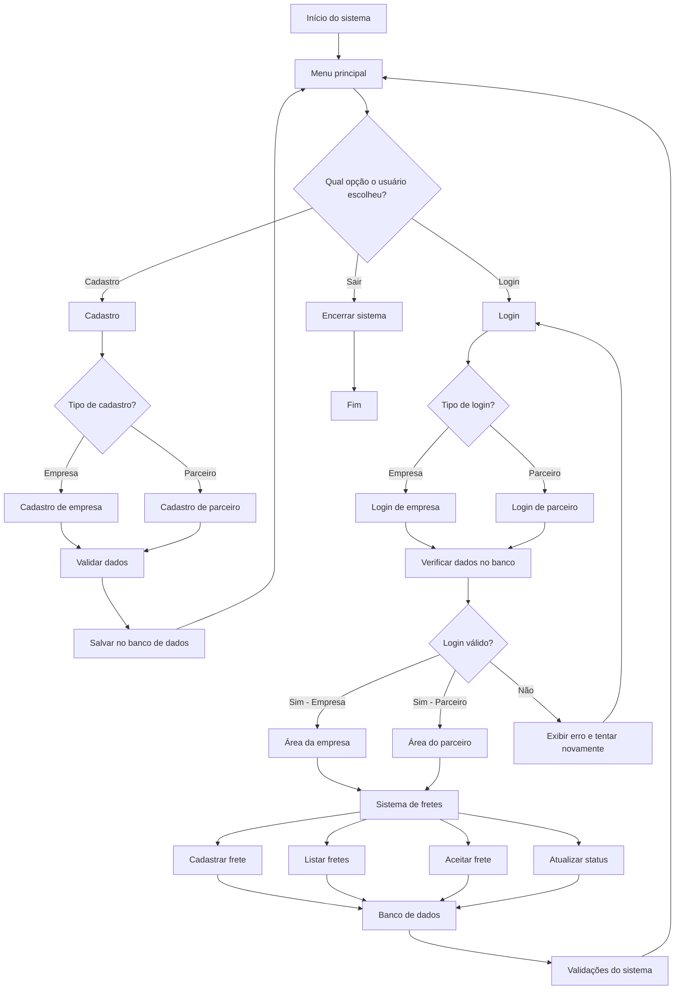

# Fluxograma Geral - TruckConnect

Este arquivo organiza o fluxo principal do projeto para servir de base na montagem do diagrama no Miro.

## Estrutura Principal

## Blocos Principais

- Início do sistema
- Menu principal
- Cadastro
- Login
- Área da empresa
- Área do parceiro
- Sistema de fretes
- Banco de dados
- Validações do sistema
- Encerramento

## Subdivisão por Área

### 1. Menu principal

- Entrar no sistema
- Escolher cadastro
- Escolher login
- Sair

### 2. Cadastro

- Cadastro de empresa
- Cadastro de parceiro
- Validação de dados
- Salvamento no banco

### 3. Login

- Login de empresa
- Login de parceiro
- Verificação no banco
- Liberação de acesso

### 4. Área da empresa

- Cadastrar frete
- Listar fretes cadastrados
- Editar frete
- Acompanhar status

### 5. Área do parceiro

- Ver fretes disponíveis
- Ver detalhes do frete
- Aceitar frete
- Atualizar status do frete

### 6. Banco de dados

- Empresas
- Parceiros
- Fretes

### 7. Validações

- Validar CPF
- Validar CNPJ
- Evitar dados duplicados
- Verificar campos obrigatórios
- Validar status do frete
